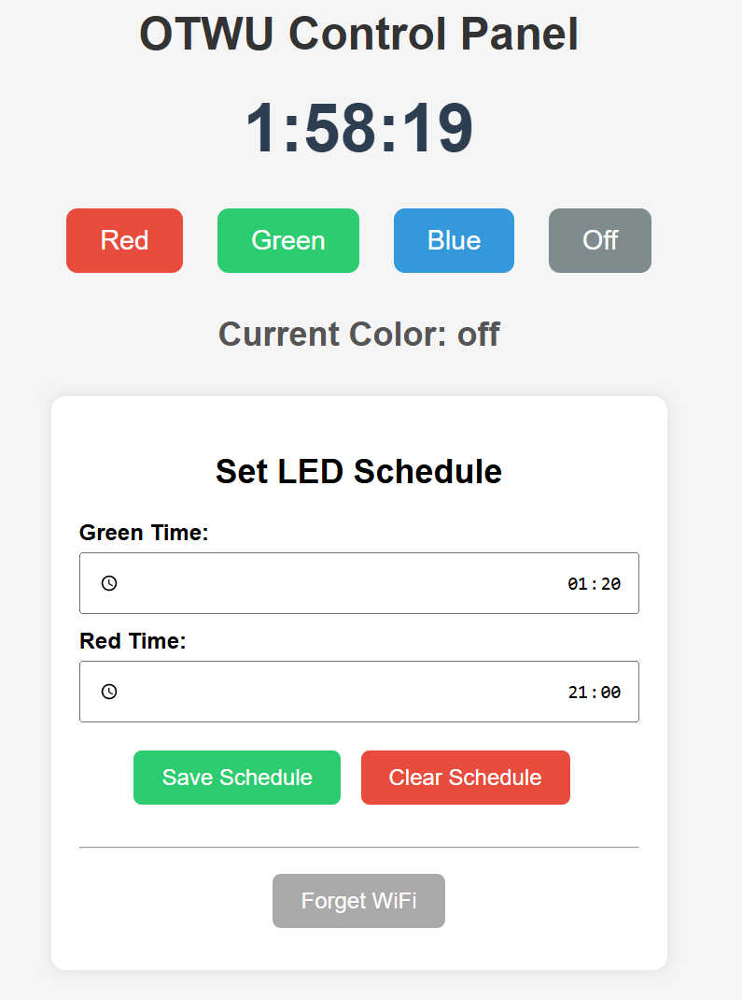
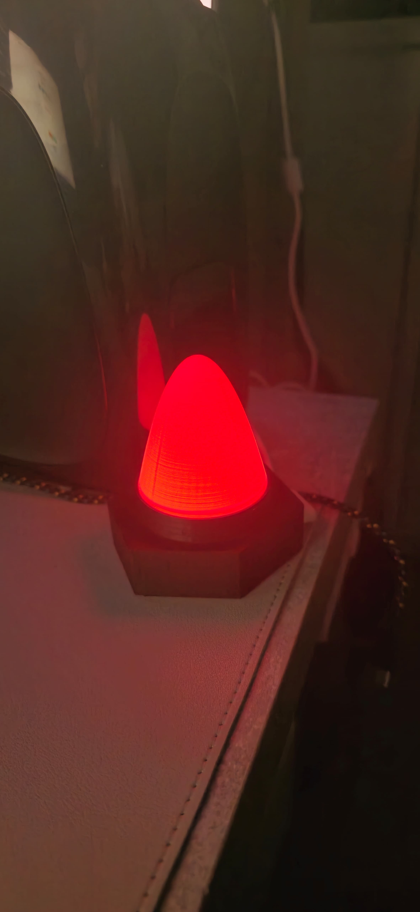
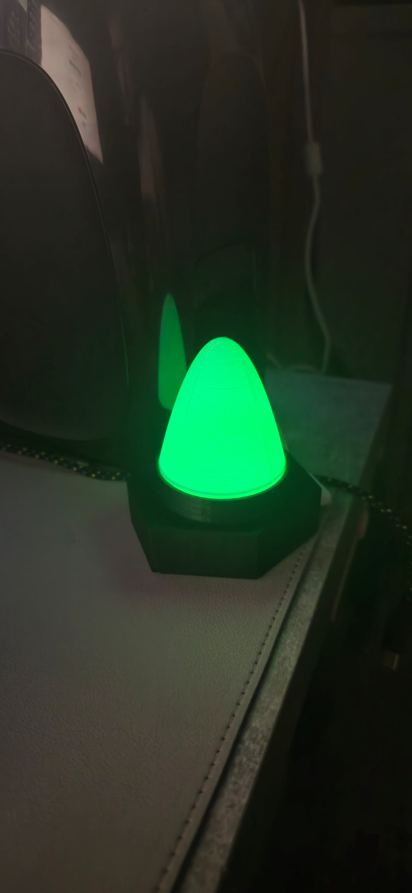
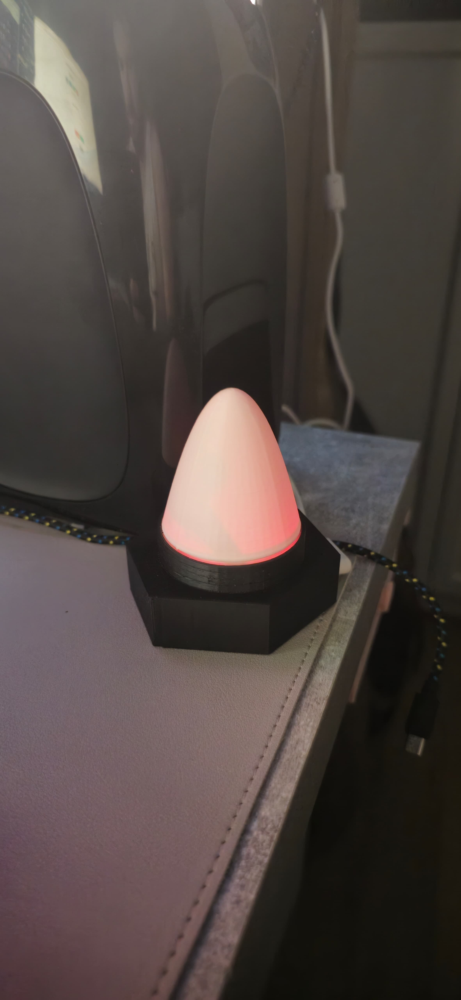

# OK TO WAKE UP

A smart, responsive LED controller built on the ESP32 platform. It features MQTT integration, a modern web interface, WiFi connectivity, and an interactive Captive Portal for initial setup.

---

## 🚀 Overview
This project is an ESP32-based LED controller that integrates with:
- An MQTT broker for real-time control
- A responsive web interface for manual operation
- A Captive Portal for easy WiFi configuration when no credentials are saved

---

## ✨ Features
- Control LED color via MQTT messages
- Interactive web UI with styled color buttons
- WiFi connectivity with auto-reconnect
- Captive Portal for first-time WiFi setup
- Manual "Forget WiFi" button with SweetAlert confirmation
- Schedule system for timed color switching (e.g., green in the morning, red at night)
- FastLED library support
- Real-time color indicator
- Fully 3D-printed enclosure

---

## 🔧 Hardware Requirements
- ESP32 development board
- WS2812B LED strip (or similar addressable RGB LED)
- WiFi network access
- USB power supply

---

## 💻 Software Requirements
- PlatformIO or Arduino IDE
- ESP32 board package
- Required libraries:
  - `FastLED`
  - `PubSubClient`
  - `ESPAsyncWebServer`
  - `AsyncTCP`
  - `WiFi`

---

## 📦 Installation
```bash
git clone https://github.com/Korenhalevie/OTWU.git
cd ESP32-LED-MQTT
```
1. Open the project in PlatformIO or Arduino IDE  
2. Install all required libraries  
3. Update your WiFi and MQTT credentials (see below)  
4. Upload to your ESP32 board  

---

## ⚙️ Configuration
Edit `config.h`:
```cpp
const char *ssid = "YOUR_WIFI_SSID";
const char *password = "YOUR_WIFI_PASSWORD";

const char *mqtt_broker = "broker.emqx.io";
const int mqtt_port = 1883;
const char *mqtt_topic = "ok_to_wake/color";
```

---

## 📡 MQTT Usage
To control the LED color, publish messages to the topic:
```
ok_to_wake/color
```
**Supported messages:**
- `red`
- `green`
- `blue`
- `off`

---

## 🌐 Web Interface
Once the device is connected to your WiFi network, you can access the control panel via `http://otw.local` or the assigned local IP (e.g., `http://192.168.1.x`).

If no WiFi is configured, the ESP32 boots into Access Point (AP) mode and opens a **Captive Portal**, allowing you to select and enter your home WiFi credentials. Once connected, the AP closes and the system becomes accessible via your LAN.


- Clickable color buttons (styled to match actual colors)
- Real-time LED color display with a live color circle
- Schedule section for "green time" and "red time"
- **Forget WiFi** button with popup confirmation

---

## 📅 Scheduling
The web UI includes inputs for scheduling color changes:
- Green Time (e.g. morning light)
- Red Time (e.g. bedtime)

These are stored using Preferences and persist across restarts.

---

## 🖼️ Real-World Device

| Red Mode | Green Mode | Off Mode |
|----------|------------|----------|
|  |  |  |

---

## 🖨️ 3D Printed Case

All STL files for the enclosure are available under `/case/`:
- [`oktw_base.stl`](case/oktw_base.stl)
- [`oktw_top.stl`](case/oktw_top.stl)

Fits ESP32 + WS2812 + USB power inside a sleek tabletop enclosure.

---

## 📁 File Highlights
- `main.cpp` – Entry point, handles setup and loop
- `WebServerManager.*` – Async web server and HTML rendering
- `MQTTManager.*` – MQTT connection, message handling
- `LEDController.*` – LED color control via FastLED
- `ScheduleManager.*` – Time-based logic storage
- `CaptivePortalManager.*` – SoftAP mode and initial WiFi configuration

---

## 📜 License
This project is open-source under the MIT License.

---

## 👤 Author
Developed and maintained by **Koren Halevie**

For questions, improvements or feature requests, feel free to open an issue or submit a PR!
